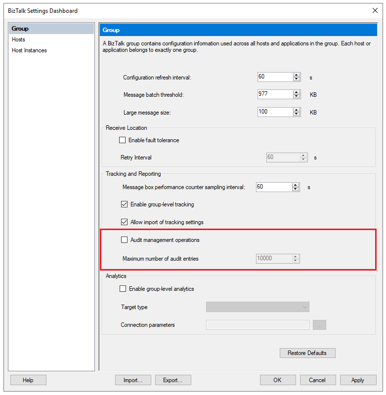

# How to Audit Management Operations

## Overview

**Starting with BizTalk Server 2020**, you can audit management operation on application artifacts like send port, receive port, receive locations, orchestrations, resources etc. Auditing of Suspend/resume/terminate operation on service instances is also possible.

## Configure auditing

In fresh installation, auditing is disabled by default. To enable auditing:

 1. Open the **BizTalk Server Administration** console, right-click the **BizTalk Group**, and select **Settings**.

 2. Check **Audit management operations**.

 3. By default, **10000** audit log entries are stored in audit log table. If you want to change this, change **Maximum number of audit entries** setting to desired number.

 4. Select **OK** to save your changes.

 5. Refresh **BizTalk Server Administration**, if you want to do any management operation in same session.

   

## Viewing audit logs

1. Ensure that BizTalk operational data service is configured.
2. Open a browser and type  http://localhost/BizTalkOperationalDataService/AuditLogs .

3. To fetch audit log entries between a date range use http://localhost/BizTalkOperationalDataService/AuditLogs?fromDate=2019-12-25T01:00:00&toDate=2020-01-10 . Supported date formats for filtering are : *yyyy-MM-dd* or *yyyy-MM-ddThh:mm:ss* .

## Audit Log Structure

When an artifact is created/updated, one or more audit log entries are created. For example, when a send port is created, then 3 audit log entries are created; one for send port, one for primary transport and one for secondary transport. All these entries will have same **BatchId**. Audit log entries for primary and secondary transport can be correlated with send port using **ArtifactId** and **ParentArtifactId** values.

An audit log entry has following information:

- **Id**: An unique id of type Guid.
- **BatchId**: All audited operations performed in same SQL transaction has same batch id.
- **UserPrincipal**: The User who performed the operation, for example, `jeffsmith@Fabricom.com`.
- **Machine**: Machine name from which operation was performed, for example, `machine1@contoso.com`.
- **ArtifactId**: Unique id of the artifact.
- **ParentArtifactId**: Parent artifact id. If an artifact is child of another artifact, then ParentArtifactId of child artifact will have artifact id of the parent artifact.
- **ArtifactType**: Type of artifact on which operation was performed, for example `SendPort,ReceivePort, Application etc`.
- **ArtifactName**: Name of the artifact, for example, `FTP send port`.
- **OperationName**: Action performed on the artifact, for example `Create`.

  Following table summarizes possible operations name on different artifacts:

   | Artifact type | Operation name|
   | --- | --- |
   | Ports | Create/Update/Delete |
   | Service Instances | Suspend/Resume/Terminate |
   | Application resources | Add/Update/Remove |
   | Binding file | Import|

- **Payload**: Contains information about what is changed in JSON structure, for example, `{"Description":"New description"}`.
- **CreatedDate**: Timestamp when the operation was performed.
